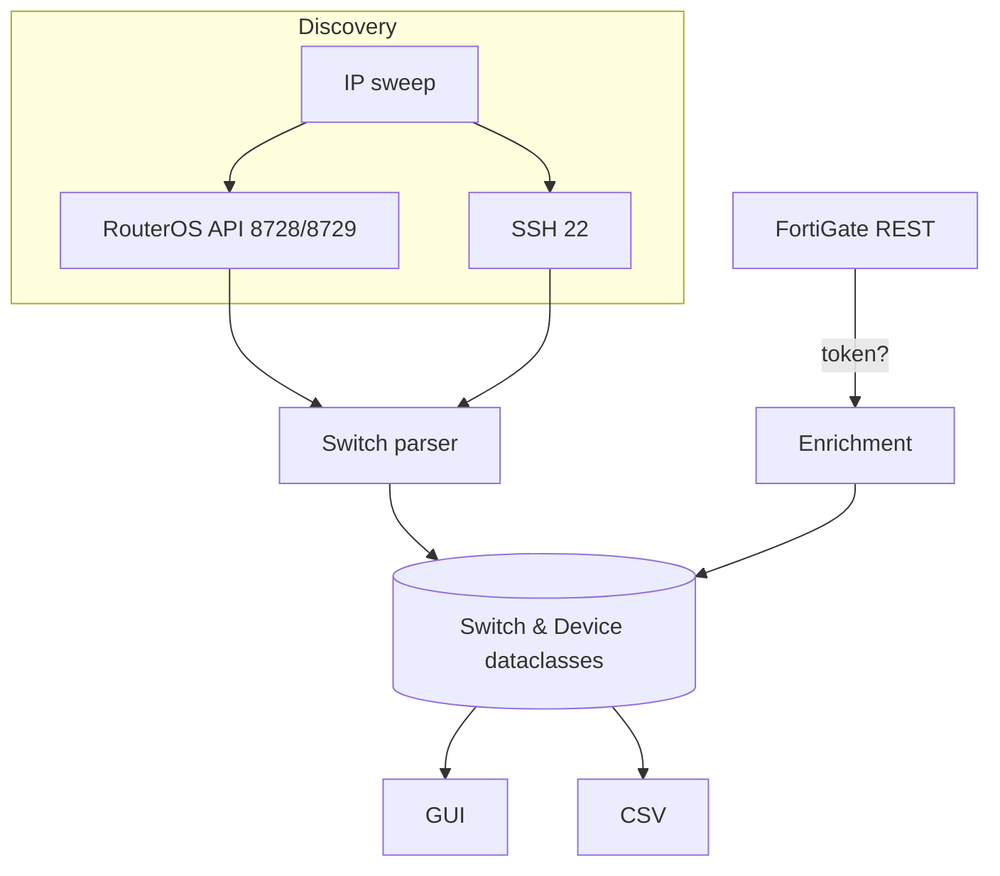

**TL;DR**\
**BraaSMAN** (Branch - as - a - Service ‑ Manager) is a Python 3 / PyQt6 desktop app that auto - discovers MikroTik switches in `192.168.99.0/24`, presents their Layer - 2 tables in a clean GUI, and—if you supply a FortiGate API token—enriches every MAC with FortiGate’s device - type and OS guess. First run takes \~3 seconds; clone → `poetry install` → create a `.env` → `poetry run braasman`. Future milestones add MAC - vendor lookups, scheduled diffs, and northbound data sync.

---

# BraaSMAN

**Branch - as - a - Service ‑ Manager – local network inventory for MikroTik & FortiGate environments**\
*Version 0.1a (MVP)*

---

## Table of Contents

1. Rationale
2. Feature Set (v0.1)
3. Quick Start
4. Full Installation
5. Configuration
6. Running BraaSMAN
7. GUI Tour
8. Architecture
9. Development & Contributing
10. Testing
11. Packaging Targets
12. Roadmap
13. FAQ / Troubleshooting
14. Security Considerations
15. License

---

## 1 Rationale

Branch networks deserve instant clarity. MikroTik’s CLI gives detail without overview; FortiGate sees OS traits but not which switch port. **BraaSMAN** stitches both perspectives into one lightweight, local application—designed to be extended into the wider *Branch - as - Service* ecosystem.

---

## 2 Feature Set (v0.1)

| Category                 | Implemented                                   | Deferred                                |
| ------------------------ | --------------------------------------------- | --------------------------------------- |
| **Discovery**            | Scan `192.168.99.0/24` for MikroTik API/SSH   | LLDP/CDP neighbor crawl, multi - subnet |
| **Switch Data**          | Hostname, IP, primary MAC, bridge host table  | VLAN tags, port traffic stats           |
| **FortiGate Enrichment** | Device type + OS via REST token               | Active vulnerability probe              |
| **GUI**                  | PyQt6 hierarchical table, Refresh, CSV export | Dark mode, search/filter                |
| **Persistence**          | Fresh scan each run; CSV export               | DB/SQLite, historical diff              |
| **Packaging**            | Poetry venv                                   | AppImage / PyInstaller (roadmap)        |

---

## 3 Quick Start

```bash
# Clone
git clone https://github.com/your ‑ org/braasman.git
cd braasman

# Install (Python ≥ 3.10)
curl -sSL https://install.python-poetry.org | python3 -
poetry install --only main

# Configure credentials
cp .env.sample .env
$EDITOR .env

# Run
poetry run braasman
```

---

## 4 Full Installation

### 4.1 Prerequisites

| Item               | Version tested             |
| ------------------ | -------------------------- |
| Ubuntu             | 22.04 LTS                  |
| Python             | 3.10+                      |
| RouterOS           | 7.18+ (API or SSH enabled) |
| FortiOS (optional) | 7.x with API token         |

### 4.2 System packages

```bash
sudo apt update
sudo apt install -y build-essential libssl-dev libffi-dev libglib2.0-dev
```

### 4.3 Poetry environment

```bash
curl -sSL https://install.python-poetry.org | python3 -
poetry config virtualenvs.in-project true
poetry install --with dev
```

---

## 5 Configuration

`.env` (preferred) or `config.yaml`:

```dotenv
# BraaSMAN credentials & settings
MT_USER=monitor
MT_PASS=Correct-Horse-Battery-Staple
FG_API_TOKEN=         # leave blank to skip FortiGate enrichment
FG_VERIFY_SSL=false   # true if FortiGate has valid cert
SCAN_RANGE=192.168.99.0/24
```

*`.env`** is already in **`.gitignore`**—keep it that way.*

---

## 6 Running BraaSMAN

```bash
poetry run braasman               # normal run
poetry run braasman --debug       # verbose logging to ~/.local/share/braasman/app.log
poetry run braasman --no-fg       # skip FortiGate calls even if token present
```

---

## 7 GUI Tour

```
┌─── BraaSMAN – Branch Inventory ─────────────────────────────────────────────────────────────────┐
│ Hostname        IP              MAC               Devices  [Refresh│
│ core-sw         192.168.99.2    4C:5E:0C:AA:BB:01        54       │
│ access-01       192.168.99.3    4C:5E:0C:AA:BB:02        12       │
│ guest-edge (4)  192.168.99.4    4C:5E:0C:AA:BB:03         9       │
│                                                             ▼    │
└──────────────────────────────────────────────────────────┘
```

- Double - click any switch to open its MAC - to - port table; optional columns “FG Type” and “FG OS” appear if data exists.
- **Refresh** button re - scans; **Export CSV** saves to `~/braasman_inventory_<date>.csv`.

---

## 8 Architecture



- Threaded scan keeps UI responsive.
- RouterOS commands: `/system/identity/print`, `/interface/ethernet/print where default-name~"ether1"`, `/interface/bridge/host/print`.
- SSH fallback parses identical commands in plain text.
- FortiGate endpoint: `monitor/user/device/query?mac=<MAC>`.

---

## 9 Development & Contributing

1. Fork and branch (`feature/<topic>`).
2. `poetry install --with dev` – brings in `ruff`, `black`, `pytest`.
3. `pre-commit install` – auto - formats before each commit.
4. Keep PRs atomic; update docs/tests.
5. CI (GitHub Actions) runs lint + unit tests; green or bust.

---

## 10 Testing

```bash
poetry run pytest -q
poetry run coverage html
```

Mock fixtures emulate RouterOS sentences and FortiGate JSON.

---

## 11 Packaging Targets

| Tool                          | Status        | Command                     |
| ----------------------------- | ------------- | --------------------------- |
| **Wheel/sdist**               | Ready         | `poetry build`              |
| **PyInstaller single - file** | Planned (0.2) | `pyinstaller braasman.spec` |
| **AppImage**                  | Roadmap (0.3) | `tools/build_appimage.sh`   |

Artifacts collect in `dist/`.

---

## 12 Roadmap

| Version | Highlights                                              |
| ------- | ------------------------------------------------------- |
| 0.2     | MAC - vendor lookup, search/filter, dark mode           |
| 0.3     | Scheduled scans, diff alerts (email/Telegram), AppImage |
| 0.4     | Global inventory sync via MQTT, REST API backend        |
| 1.0     | RBAC, device notes, Docker/K8s deployment               |

---

## 13 FAQ / Troubleshooting

| Problem              | Cause / Resolution                                                                                            |
| -------------------- | ------------------------------------------------------------------------------------------------------------- |
| No switches detected | Enable `/ip service api` or SSH on MikroTiks; confirm firewall rules.                                         |
| “FG columns” empty   | Missing/invalid `FG_API_TOKEN` or FortiGate hasn’t fingerprinted device yet—let traffic flow, then *Refresh*. |
| GUI freeze           | File issue with `~/.local/share/braasman/app.log`.                                                            |
| CSV export blank     | No switches discovered or write - permission denied in `$HOME`.                                               |

---

## 14 Security Considerations

- `.env` contains plaintext credentials—never commit.
- Prefer TLS API (`api-ssl`, port 8729) so RouterOS creds travel encrypted.
- Grant FortiGate token **read - only monitor** scope. Rotate periodically.
- Active network probing is performed; run BraaSMAN only on trusted admin hosts.

---

## 15 License

MIT—free to use, modify, and profit. Attribution appreciated, liability disclaimed.

---

> *“Obsessing over details today prevents surprises tomorrow.”*

